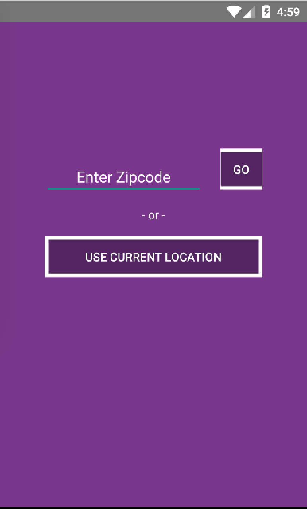

# PROG 02: Represent!

Represent allows you to look up information on congressional representatives based on your Zipcode or current location.

## Authors

Dipsikha Halder ([dhalder@berkeley.edu](mailto:your_email@berkeley.edu))

## Demo Videos

See [a stage 2 walkthrough of Represent!] (https://youtu.be/rPVZZPiivFk)

See [a final walkthrough of Represent! with API Integration] (https://youtu.be/hr89pHkX0Ak)

[A case where more than 3 candidates are returned] (https://youtu.be/O9SdnX8OLzs)

## Screenshots

### Main View: Mobile

#### Final 

My final watch and phone views. The watch interface simply displays the application name until location input is received in the mobile interface (This view did not change from Part B). There are now two buttons: “GO” indicates that the user has entered their Zipcode and the other button moves into the Congressional View with the user’s current location. The original home screen is displayed below:

#### Part B Version

I initially designed the main view with one button to launch the Congressional View but while implementing Part C, felt that this wasn’t an intuitive layout. In my final iteration, this is reflected in the way I used two buttons to distinguish between the two options available to the user. 

### Congressional View: Mobile and Main View: Watch

#### Final 

When the application transitions into the Congressional View, a feed of all the corresponding candidates is generated based on the input. Backgrounds are color coded by each candidate’s party and each row contains the candidate’s name, links to their email and website, and most recent tweet. The arrows on the left allow the user to expand into the detailed Mobile View to view further details about each candidate.

#### Part B Version

In my previous iteration, I used the default Android CardFragment interface that displayed the candidate’s name, party, and a poorly positioned photo:

### Detailed View: Mobile 

#### Final

Instead of having a stretched out photo on the top, I decided to use a square icon next to the name and end date in my redesign. The committees are listed first, followed by the bills underneath. I changed the view to a scroll view so the user would be able to access all the information more easily and cleanly. I added the color coded background as well to maintain a similar style to all the other views.

#### Part B Version

My original detailed view used the candidate’s picture as a header and contained two columns, one for the committees and the other for the bills. I quickly realized this layout would create readability issues and moved into a cleaner layout that was easier to read.

### 2012 Vote View: Watch 

#### Final

The layout of my 2012 view did not change from Part A/B to Part C. I used different font sizes to create a sense of hierarchy in the information being displayed. This view includes the state, county, and percentage votes for 

### Shake 

My shake screens remained the same as well. Upon detecting a shake event, a small splash screen indicating that a random location is being generated is displayed. This automatically transitions into a screen that displays the random county and state. The user has the option to accept the suggestion or reject it, and depending on which button is clicked, the data is updated accordingly.
